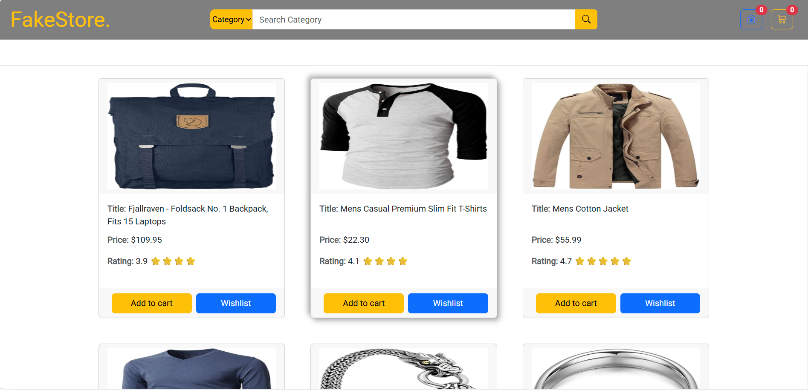
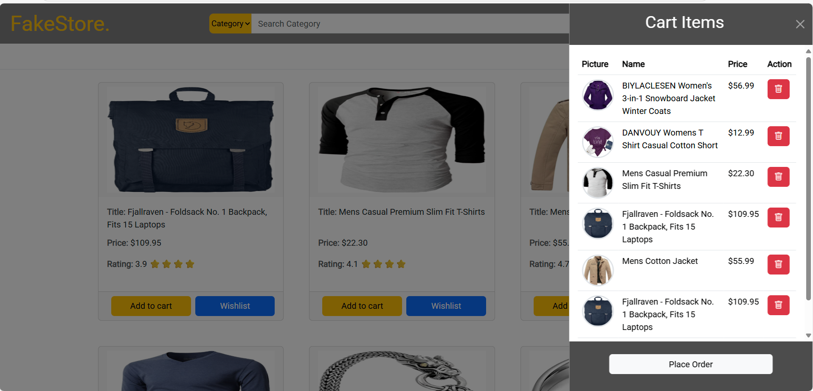

# 🛒 FakeStore React App

A fully responsive e-commerce UI built with **React**, **Bootstrap**, and **Axios** that interacts with the [FakeStore API](https://fakestoreapi.com/). This application features product listings, search and filter capabilities, a shopping cart, and a wishlist with interactive off-canvas panels.

---

## 🚀 Features

- 🔍 Search products by title
- 📂 Filter products by category
- 🛍️ Add/remove products to/from **Cart**
- 💖 Add/remove products to/from **Wishlist**
- 🧾 View total cart value
- 📱 Fully responsive design
- 📦 Built using [FakeStoreAPI](https://fakestoreapi.com/)

---

## 🧪 Tech Stack

- **React** (Functional Components & Hooks)
- **Axios** for API calls
- **Bootstrap 5** for styling and layout
- **React Context API** for managing search and category state

---

## 📁 Project Structure

fakestore-react-app/
├── public/
├── src/
│ ├── components/
│ │ ├── Fakestore.js // Main app logic and layout
│ │ ├── FakestoreFooter.js // Footer component
│ │ └── Fakestore.css // Custom styling
│ ├── App.js
│ └── index.js
├── package.json
└── README.md

📸 Screenshots
📦 	🛍 	

---

### 📺 Live Demo
👉 [View on GitHub Pages](https://sachinparshetti.github.io/Fakestore/)


## 🛠️ Installation

1. **Clone the repository**

```bash
git clone https://github.com/your-username/fakestore-react-app.git
cd fakestore-react-app
Install dependencies

bash
Copy
Edit
npm install
Start the development server

bash
Copy
Edit
npm start
App will be available at http://localhost:3000


📡 API Used
GET /products – Fetch all products

GET /products/categories – Get all product categories

See full API documentation
```


## 🧑‍💻 Author

**Sachin Parashetti**  

[](https://github.com/SachinParshetti)
[](https://www.linkedin.com/in/sachin-parashetti-99b255259)
[](mailto:sachinparshettisp@gmail.com)
